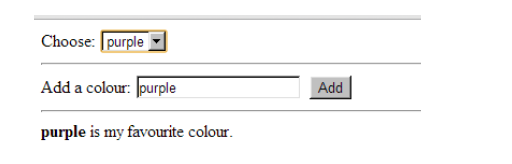
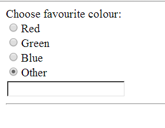
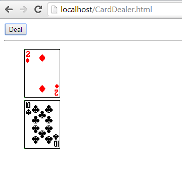

# JavaScript Exercise 4 - DOM Manipulation
		
> Note:: Complete ALL the exercises in this section.


## Fetch latest Repository Branch

```
$ cd /DRIVE/xampp/htdocs/JavaScript
$ git pull --no-edit https://github.com/noucampdotorgCSS2019/JavaScript.git latest
$ git status

```

Check your ``htdocs/JavaScript`` folder.  You should have some new files in it.

	
# Part 1


1.	Examine the code in ``Artists.html`` and ``Artists.js``.  Then open it in your browser with [http://localhost/JavaScript/Artists.html](http://localhost/JavaScript/Artists.html).  

	Understand why the ``<li>`` for *Miley Cyrus* appears.

1.	Modify the code so that the artist *Miley Cyrus* is only added to the list when you click the *Add* button.

1.	In ``Artist.html`` uncomment the HTML code for the ``<table>`` element and then view it using [http://localhost/JavaScript/Artists.html](http://localhost/JavaScript/Artists.html).

1.	Modify the code so that the artist *Miley Cyrus* is also added to the table when you click the *Add* button.

	Make sure you are using the ``<tr>`` and ``<td>`` elements correctly in your solution.

1.	Push your code solutions to **your private** repository on GitHub.  Type these commands into your *Git Bash* client:

	```
	$ cd /<DRIVE>/xampp/htdocs/JavaScript
	$ git status
	$ git add .
	$ git commit -m "Exercise 4 - Part 1 DONE|PARTIAL|HELP"
	$ git push origin master
	$ git status

	```


# Part 2


1.	Modify your previous solution in ``favouriteV2.html`` so a user can add a new colour to the drop down box using a text box. 
	
	

	Use the ``value`` property to get the text in the textbox.  For the colour shown above make sure this is HTML code added to the dropdown:

	```
	<option value="purple">purple</option>

	```

	
1.	Create a web page that initially shows just four radio buttons as shown below.
	Only if the *Other* radio button is clicked should a text box then appear.
	
	

	Try to ensure only one text box appears when clicking the Other radio button more than once.  Note: the texybox won't be used for anything.

	Keep the HTML and JavaScript in separate files please.
	

1.	Create a web page ``cardDealer.html`` that allows the user to deal cards randomly from a pack of cards as shown here:
		
	
	
	You can download the images from [here](../images/cards.zip?raw=true).

	Ensure a maximum of 5 cards can be dealt and never deal the same card more than once.

	Use this code to generate a random number::
	```	
		var num=Math.floor(Math.random()*52)+1;

	```

1.	Push your code solutions to **your private** repository on GitHub.  Type these commands into your *Git Bash* client:

	```
	$ cd /<DRIVE>/xampp/htdocs/JavaScript
	$ git status
	$ git add .
	$ git commit -m "Exercise 4 - Part 2 DONE|PARTIAL|HELP"
	$ git push origin master
	$ git status

	```
