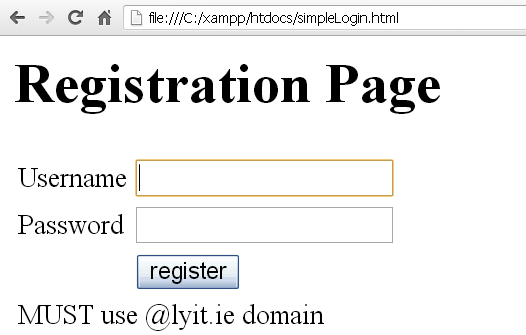

# JavaScript Exercise 5 - Form Validation
		
> Note:: Complete ALL the exercises in this section.


## Fetch latest Repository Branch

```
$ cd /DRIVE/xampp/htdocs/JavaScript
$ git pull --no-edit https://github.com/noucampdotorgCSS2019/JavaScript.git latest
$ git status

```
	
# Part 1 - Registration Form

1.	Examine the code in ``register.html`` and ``register.js``.  Then open it in your browser with [http://localhost/JavaScript/register.html](http://localhost/JavaScript/register.html).  

1.	Modify the code in ``register.html`` so it renders the output shown:
	
	

	Notice the text underneath the register button hinting at what should be typed when the user is inputting text into the *Username* textbox. 
	
	Write the necessary JavaScript so the hint "MUST use @lyit.ie domain" is only shown when the user clicks inside the username textbox, and use the hint "MUST be min of 6 characters" when the user clicks inside the password textbox. 

	Initially and when no text is being input the hint text is not shown.

	Test everything works.

1.	Update the registration page to ensure the password input has a minimum of 6 characters. 
	Display an appropriate warning message using red text if someone tries to register using a password that is too short and do not submit the form.
	
1.	Update the registration page to ensure the email address uses the ``@lyit.ie`` domain name. 
	Display an appropriate warning message using red text if someone tries to register using 
	an email that is incorrect and do not submit the form.

	[This](http://www.w3schools.com/jsref/jsref_substring.asp) web page has some code that you 	can use in your solution.

1.	Push your code to **your private** repository on GitHub.  Type these commands into your *Git Bash* client:

	```
	$ cd /<DRIVE>/xampp/htdocs/JavaScript
	$ git status
	$ git add .
	$ git commit -m "Exercise 5 - Part 1 DONE|PARTIAL|HELP"
	$ git push origin master
	$ git status

	```
