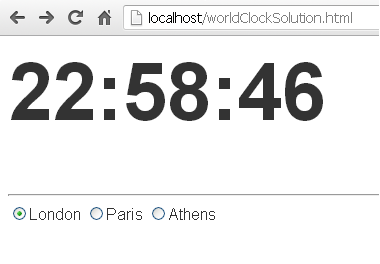

# JavaScript Exercise 6 - Timers and All
		
> Note:: Complete ALL the exercises in this section.


## Fetch latest Repository Branch

```
$ cd /DRIVE/xampp/htdocs/JavaScript
$ git pull --no-edit https://github.com/noucampdotorgCSS2019/JavaScript.git latest
$ git status

```
	
# Part 1

1.	Examine the code in ``SimpleTimer.html`` and ``SimpleTimer.js`` that implements a simple timer.  Then open it in your browser with [http://localhost/JavaScript/SimpleTimer.html](http://localhost/JavaScript/SimpleTimer.html).  
	
1.	The JavaScript code below gets the current time ``t`` from the ``Date`` object in the format HH:MM:SS (e.g. 2:30:00 PM)

	```java
	var d = new Date();
	var t = d.toLocaleTimeString(); // t is the current time

	```

	Modify the HTML [http://localhost/JavaScript/clock.html](http://localhost/JavaScript/clock.html) and JavaScript ``clock.js`` files to implement a simple digital clock that shows the current time using ``t``. It should update every second.

1.	Push your code to **your private** repository on GitHub.  Type these commands into your *Git Bash* client:

	```
	$ cd /<DRIVE>/xampp/htdocs/JavaScript
	$ git status
	$ git add .
	$ git commit -m "Exercise 6 - Part 1 DONE|PARTIAL|HELP"
	$ git push origin master
	$ git status

	```


# Part 2 - The Final CountDown

1.	Run the code [http://localhost/JavaScript/countDown.html](http://localhost/JavaScript/countDown.html).  Type 1 into the text box and start the countdown.

	Take time to examine the source code and understand what is going on.  There's quite a bit going on!


1.	Make the following modifications to the CountDown code:

	(a) Modify the code so the minimum value allowed is 1 and the maximum is 10.
	
	(b) When the countdown seconds reaches 10 seconds, the remaining seconds should be displayed using the colour red.
	
	(c) Add a *Pause* button so the countdown can be paused when this button is pressed. When the *Pause* button is pressed change the caption of the button to *Restart*. 
	
	(d) When the *Restart* button is pressed the countdown should resume and the button caption should become *Pause* again. 

	Only have the *Pause* button appear when the countdown begins, and when the countdown reaches 0 (ZERO) this button should disappear.


1.	Push your code to **your private** repository on GitHub.  Type these commands into your *Git Bash* client:

	```
	$ cd /<DRIVE>/xampp/htdocs/JavaScript
	$ git status
	$ git add .
	$ git commit -m "Exercise 6 - Part 2 DONE|PARTIAL|HELP"
	$ git push origin master
	$ git status

	```

# Part 3 - The Clock

1.	You must implement a simple digital clock as shown below that can display the time in three cities in different timezones. 
	
	

	When the page [http://localhost/JavaScript/worldClock.html](http://localhost/JavaScript/worldClock.html) is initially displayed it will show the current time in London (GMT) and update the time every second.
	
	When another city in a different timezone is clicked the correct time for that timezone should appear.
	
	London=GMT, Paris=GMT+1, Athens=GMT+2
	

1.	In the (unlikely) event that you should run this program after 2200 hours make the necessary modifications to ensure the hour time never shows 24 or 25 when the hours for Paris and Athens time are chosen. 


1.	Push your code to **your private** repository on GitHub.  Type these commands into your *Git Bash* client:

	```
	$ cd /<DRIVE>/xampp/htdocs/JavaScript
	$ git status
	$ git add .
	$ git commit -m "Exercise 6 - Part 3 DONE|PARTIAL|HELP"
	$ git push origin master
	$ git status

	```

